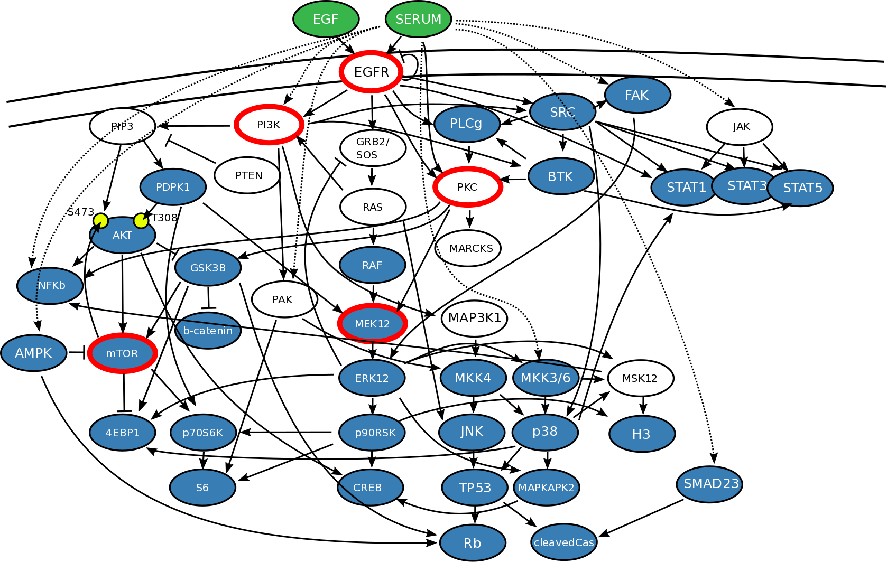

```{r setup}
library(dplyr)
library(tidyr)
library(tibble)
library(ggplot2)
```

## Task 1

Import the cell line data from Tognetti et al (2021):

```{r}
cell_line_data <- readRDS("./data/Median_allsamples_nocontrols_withcellcount.rds")

```

# Compare the dynamics of 2 cell lines across 5 markers

Interesting case: cell lines MDAkb2 vs UACC3199
marker p-S6

```{r}
data <- cell_line_data %>% select(-`dmt$cellcount`) %>%
    gather(marker,value,-cell_line,-treatment, -time, -time_course) %>%
    mutate(time = as.numeric(as.character(time)))

# select randomly:
# cell_lines <- data %>% pull(cell_line) %>% unique() %>% sample(2)
# markers <- data %>% pull(marker) %>% unique() %>% sample(5)

cell_lines <- c("MDAkb2" , "UACC3199")
markers <- c("CyclinB","p-H3","p-PDPK1","p-S6","p-SMAD23")

data %>% filter(cell_line %in% cell_lines,
               marker %in% markers) %>%
    ggplot(aes(time,value)) + geom_line(aes(col=cell_line)) + facet_grid(treatment~marker)
```

can you explain the behaviour of p-S6 based on the network: 




```{r}
sessionInfo()
```

